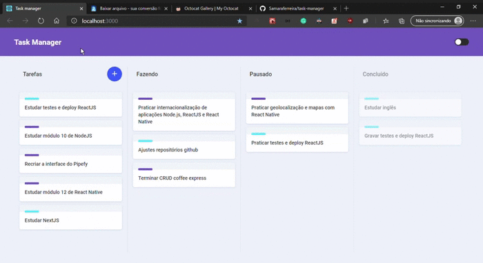

<h1 align="center">
  Task Manager with theme switcher
</h1>

## Techs
- ReactJS
- TypeScript
- Styled-components
- Eslint
- Prettier
- Editor Config

<p align="center">
  
</p>

## Running locally

```sh
yarn install

yarn start
```
Open [http://localhost:3000](http://localhost:3000) to view it in the browser.
